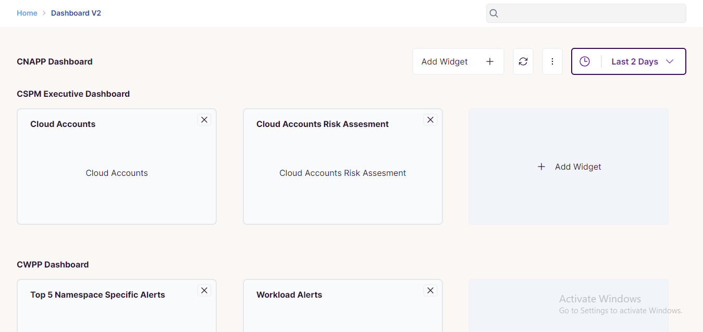
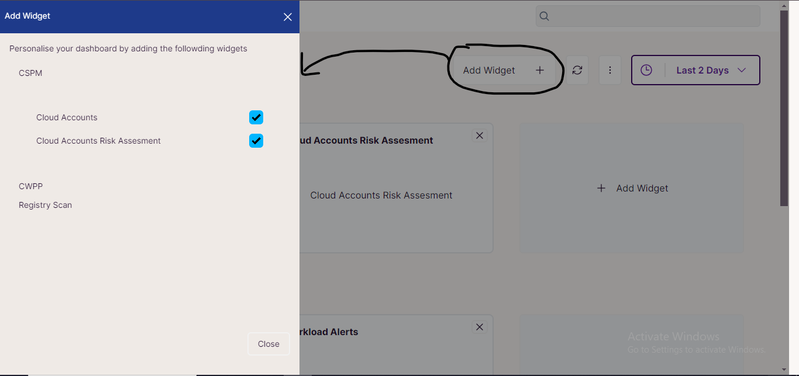
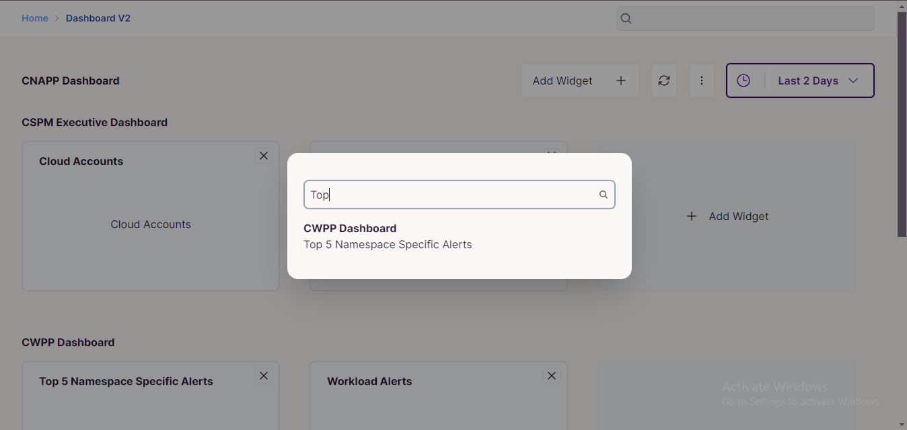

# React + TypeScript + Vite + Tailwidcss + DaisyUI

### Installation Steps
1.  ``` git clone ``` or download the zip file from the [source]()
2. ``` cd  & npm i & npm run dev ```

### Features

#### Dashboard Page


- It include different widget categories where we can add new widgets or delete from the individual category section.

- From the sidebar or cross button on the individual widget we can hide the widget from the dashboard


- From the search modal we can search any widget of any category
